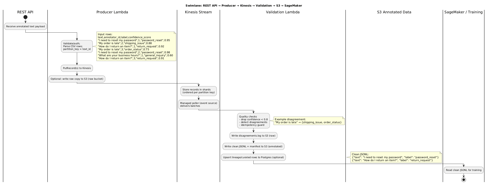

# Text Annotation Pipeline Design

## Overview
Goal: continuously turn raw text (e.g., support tickets) into a high-quality, versioned training set for intent classification.

## Architecture Diagram (text)
.jpg>)

## Component Descriptions
- **REST API + EventBridge (optional):** Entry point for annotated text; EventBridge can trigger batch ingests.
- **Producer Lambda:** Validates/authenticates input, optionally writes a raw copy to S3, and publishes records to Kinesis partitioned by `text_id` for per-text ordering.
- **Kinesis Stream:** Durable, ordered stream that buffers events; enables replay and isolates producers from consumers.
- **Validation Lambda:** Consumes Kinesis batches, drops low-confidence rows, logs label disagreements, enforces idempotency, writes clean JSONL + manifest, and can upsert lineage/curated rows into Postgres.
- **Raw S3 Bucket:** Landing zone for raw copies and `disagreements.log`.
- **Clean S3 Bucket:** Versioned JSONL outputs with manifests for reproducible training sets.
- **Postgres (lineage/curated):** Stores dataset_version, counts, code SHA, and (optionally) curated rows for audit/BI.
- **Training Consumers (SageMaker):** Jobs that read the latest clean JSONL from S3 for model training.

## Technology Choices
- **Stream/Queue:** Amazon Kinesis Data Streams for ordered, replayable ingest; partition by `text_id` to keep same-text events together. EventBridge can also trigger the producer Lambda on a schedule. If you need a simpler task queue, SQS + Lambda works, but this design uses Kinesis.
- **Storage for raw/outputs:** S3 – cheap, durable, easy to version folders and attach lifecycle rules.
- **Annotation DB:** PostgreSQL – relational integrity for tasks/labels, JSONB for metadata, transactional updates.
- **Annotation UI:** Lightweight web app (React/Flask) or vendor tool; authenticated; logs annotator_id and confidence.
- **Quality Validator:** Python job (batch or Lambda + Step Functions) for simple data checks; cheap to run on schedule.
- **Observability:** CloudWatch/Prometheus for job metrics (throughput, rejection counts); logs in S3/CloudWatch.

## Data Governance & Lineage
- Every annotation row carries `text_id`, `annotator_id`, `label`, `confidence`, `source_dataset_version`, `timestamp`.
- Each output run writes a manifest (JSON) with input snapshot location, code version (git SHA), filters applied, row counts, and a UUID dataset version.
- Lineage table in PostgreSQL: `dataset_version`, `source_snapshot`, `validator_code_sha`, `row_count`, `created_at`.
- Access controls: IAM roles for S3 prefixes; DB roles separating annotators vs. validators.
- Retention: keep raw data indefinitely; keep N prior output versions; enforce PII scrubbing upstream if needed.
